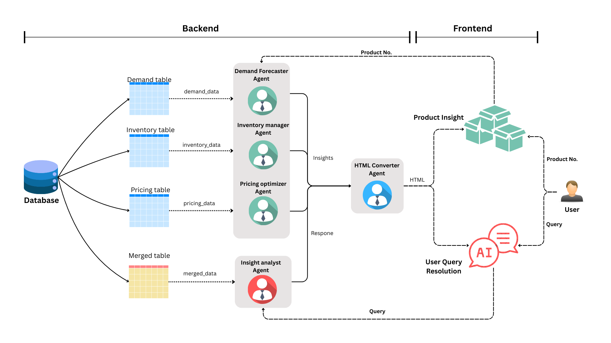

# StockSage - Personalized Retail Inventory Optimization

EcomAI is a multi-agent AI system designed to optimize retail inventory management. The system leverages advanced AI agents for demand forecasting, inventory management, and pricing optimization, with a focus on real-time predictions, optimization strategies, and data-driven decision-making.

## Agents

### Demand Forecaster
The Demand Forecaster predicts sales trends based on seasonality, identifies top-selling and declining products, and detects regional demand variations. It also flags unusual demand patterns or outliers.

### Inventory Manager
The Inventory Manager suggests optimal safety stock levels and restocking times, identifies slow-moving products, and helps optimize warehouse space. It also evaluates supplier performance to understand the impact of delays.

### Pricing Optimizer
The Pricing Optimizer analyzes price elasticity and competitor pricing, recommending dynamic pricing adjustments and discount strategies. It also simulates the impact of pricing changes on revenue.

### Insight Analyst
The InsightAnalyst agent interprets data retrieved by other agents to generate actionable insights and explanations in response to user queries. It delivers clear, human-readable answers or structured format

### HTML Converter
The HtmlConverter agent transforms raw outputs from the InsightAnalyst into well-structured HTML formats. It ensures the responses are ready for seamless rendering on the frontend for better user experience.

## System Model

Here’s an overview of the system architecture showing how different components and agents interact with each other:



## Technologies Used

### Backend
- **Ollama**: For on-prem LLMs and embedding models.
- **SQLite**: For long-term data storage and memory.
- **FastAPI**: For creating APIs that expose agents' functionalities.
- **Multi-Agent Framework (CrewAI)**: For coordinating various agents in a seamless workflow.
- **Python**: The primary language for the backend agents and API implementation.

### Frontend
- **React**: For creating interactive user interfaces.
- **JavaScript (JSX)**: For frontend logic and rendering dynamic content.

## LLM Model Used
**LLaMA 3**  
We chose LLaMA 3 for its strong language understanding and lightweight deployment via Ollama. It runs efficiently on local hardware, making it ideal for real-time multi-agent coordination without relying on cloud-based APIs.

## Setup
### 1. Install Ollama and LLaMA 3:
Make sure you have [Ollama](https://ollama.com/download) installed. Then, run the following command to pull the LLaMA 3 model:

```bash
ollama pull llama3
```

### 2. Clone the repository:
```bash
git clone https://github.com/shashidhar-N-18/StockSage.git
cd StockSage
```

### 3. Install dependencies:
```bash
pip install -r requirements.txt
```
### 4. Run the FastAPI application:
```bash
cd backend
uvicorn main:app --reload
```

### 5. Run the React application:
```bash
cd frontend 
npm run dev
```
## Backend APIs

### 1. **/chat/query** - AI Chatbot Endpoint
This API allows users to interact with the AI system by sending natural language queries. The AI processes the query using the **InsightAnalyst** agent, analyzing the available data and providing relevant responses. The result is returned as either plain text or JSON, depending on the type of request.

- **Method**: `POST`
- **Request Body**: A natural language query (e.g., "What is the current demand for product X?")
- **Response**: AI-generated answer based on the query.

Example Request:
```json
{
  "query": "What is the expected sales for product XYZ?"
}
```
### 2. **/product/insight** - Product Insights Endpoint
This API allows users to interact with the AI system by sending natural language queries. The AI processes the query using the **InsightAnalyst** agent, analyzing the available data and providing relevant responses. The result is returned as either plain text or JSON, depending on the type of request.

- **Method**: `POST`
- **Request Body**: product_id (The unique identifier for the product you wish to analyze)
- **Response**: A detailed object containing various insights related to the product.

Example Request:
```json
{
  "product_id": "4277"
}
```

